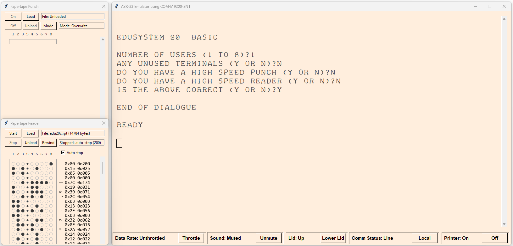

**ASR-33 terminal with paper tape reader/punch emulator.**

**Features:**

* Refactored and expanded (with the help of AI) version of Hugh Pyle's ttyemy project
* Supports Pygame and Tkinter frontends.
* Backends for serial and ssh (Paramiko library)
    Ssh has not been well tested, so use with caution.
* F1/F2 displays/hides the paper tape reader widget (written in Tkinter, but also works with the Pygame frontend)
* F3/F4 displays/hides the paper tape punch.
* By default, output is limited to an authentic 10 characters per second. Hit F5 to unthrottle the speed.
* Hit F6 to mute the sound.
* Sound is generated using Hugh Pyle's ASR-33 sound recording and Pygame mixer. The sound module Sound now works with both Tkinter and Pygame frontends. If it's too loud, hit F7 to close the lid.
* Hit F8 to switch between Line and Local modes.
* Hit F9 to turn the printer output on and off.
* Scrolling (with page up, down, home, end, mouse scroll - Tkinter frontend has a scrollbar)
* Tkinter and Pygame frontends can be launched from their modules (primarily for testing) or use the wrapper module to choose frontend/backend combinations and configurations. Supports yaml and command line parameters.
* New Teletype33.ttf font that includes lower case letters in the ASR-33 style (useful when not connected to an old computer from back in the day when only upper-case was supported)

***

**Installation Notes**

**Windows:**
Install Python3 from the Microsoft Store or Python.org website. 
(Tested using Python 3.13 on Windows 11 Home, version 25H2) 

Python package installation required to run asr33emu on Windows: 
On Windows using PowerShell or a Command Prompt: 

* python3 -m pip install PyYAML
* python3 -m pip install pyserial
* python3 -m pip install paramiko
* python3 -m pip install pygame
* python3 -m pip install pillow
* python3 -m pip install fonttools

**Ubuntu**: (Tested on 24.04.3) 
Python package installation required to run asr33emu on Ubuntu Linux: 

* sudo apt install python3-tk
* sudo apt install python3-pygame
* sudo apt install python3-pil.imagetk
* sudo apt install python3-fonttools
* sudo apt install python3-paramiko

To use serial ports in Ubuntu requires adding yourself to the dialout group: 
sudo usermod -a -G dialout $USER 
Then reboot (logout/in seems to be insufficient) 
